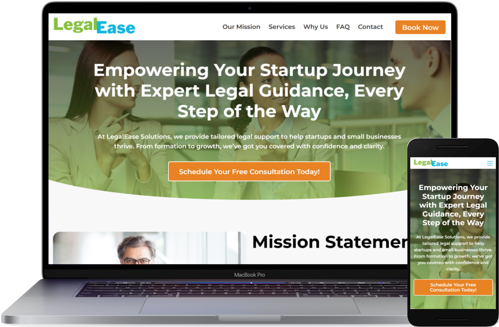

# LegalEase Template

A clean and professional website template designed for legal consulting services, specifically for startups and small businesses. Built with HTML, CSS, and minimal JavaScript, this template is responsive and easy to customize.

## Features
- Responsive design
- Smooth scrolling navigation
- Contact form with professional imagery
- Q&A section for user engagement
- Licensed under the MIT License

## Installation
1. Clone the repository: `git clone https://github.com/yourusername/legalease-template.git`
2. Open `index.html` in your browser to view the template.
3. Customize the HTML, CSS, and images to fit your needs.

## Usage
This template is ideal for legal consulting firms, startups, or small businesses looking for a professional online presence. Modify the content in `index.html` and styles in `style.css` to match your branding.

## License
This project is licensed under the MIT License. See the [LICENSE](LICENSE.txt) file for details.

## Contributing
Contributions are welcome! Please fork the repository and submit a pull request with your changes.

## Authors
- Spytnik, Getode ([movecod.com](https://movecod.com))

## Contact
For questions or feedback, reach out via [email@example.com](mailto:email@example.com).